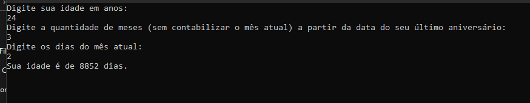

> Faça um algoritmo que leia a idade de uma pessoa expressa em anos, meses e dias e escreva a idade dessa pessoa expressa apenas em dias. Considerar ano com 365 dias e mês com 30 dias.

Passos para a resolução:

### Identificar valores constantes
"Considerar ano com 365 dias e mês com 30 dias."
```
const int DIAS_NO_ANO = 365;
const int DIAS_NO_MES = 30;
```

### Identificar valores de entrada
"Faça um algoritmo que leia a idade de uma pessoa expressa em anos, meses e dias"
```
Console.WriteLine("Digite sua idade em anos: ");
int anos = 0;
int.TryParse(Console.ReadLine(), out anos);

Console.WriteLine("Digite a quantidade de meses (sem contabilizar o mês atual) a partir da data do seu último aniversário: ");
int meses = 0;
int.TryParse(Console.ReadLine(), out meses);

Console.WriteLine("Digite os dias do mês atual: ");
int dias = 0;
int.TryParse(Console.ReadLine(), out dias);
```

### Identificar saida do programa
"escreva a idade dessa pessoa expressa apenas em dias"
```
Console.WriteLine("Sua idade é de " + idadeEmDias + " dias.");
```

### Identificar processo para gerar a saida
```
int idadeEmDias = (anos * DIAS_NO_ANO) + (meses * DIAS_NO_MES) + dias;
```

### Passos do cálculo
- Converter a idade em anos para dias
```
(anos * DIAS_NO_ANO)
```
- Converter os meses para dias
```
(meses * DIAS_NO_MES)
```
- Dias não precisa converter
```
dias
```
- Somar tudo, que dará a idade em dias
```
(anos * DIAS_NO_ANO) + (meses * DIAS_NO_MES) + dias
```

Usar constantes para representar a quantidade de dias em um ano e em um mês simplifica o cálculo, pois não é necessário considerar anos bissextos e variações no número de dias em meses como fevereiro, que tem 28 dias, ou meses que têm 30 ou 31 dias.

##### Prove que você testou o que fez e que a modificação funcionou

<div align="center">
  
</div>

##### Como testar

- Extrair a pasta <strong>Binarios.zip</strong>
- Entre na pasta extraida e execute o arquivo <strong>Questao01.exe</strong>
- Digite os valores (24, 3, 2) e será apresentado o mesmo resultado da sessão <strong>Prove que você testou o que fez e que a modificação funcionou</strong> 