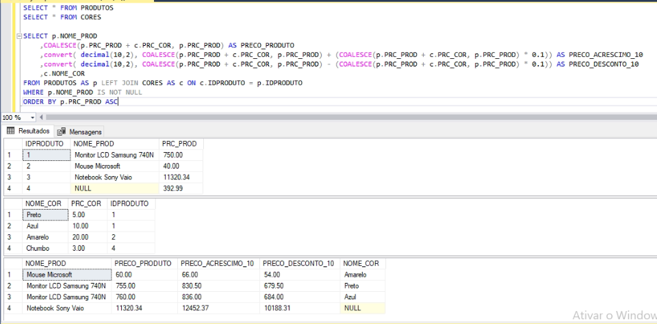
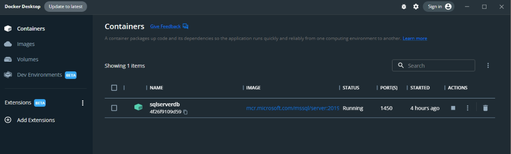
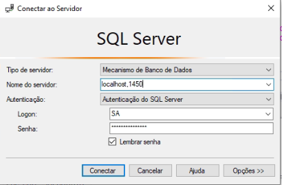

> Dada uma tabela chamada PRODUTOS e CORES, com a seguinte estrutura e dados:

##### TABELA PRODUTOS

| IDPRODUTO | NOME_PROD                | PRC_PROD  |
|---------- |------------------------- |---------- |
| 1         | Monitor LCD Samsung 740N | 750,00    |
| 2         | Mouse Microsoft          | 40,00     |
| 3         | Notebook Sony Vaio	   | 11.320,34 |
| 4         | NULL                     | 392,99    |		

##### TABELA CORES

| NOME_COR | PRC_COR | IDPRODUTO |
|--------- |-------- |---------- |
| Preto    | 5,00    | 1         |
| Azul     | 10,00   | 1         |
| Amarelo  | 20,00	 | 3         |
| Chumbo   | 3,00    | 4         |

##### Elabore o comando SQL que retorne **:
- Nome do Produto (NOME_PROD)
- Preço do Produto (PRC_PROD + PRC_COR)
- O Preço do Produto com um acréscimo de 10%
- O Preço do Produto com um desconto de 10%
- Cor do Produto

##### Este comando deve atender as seguintes premissas:
- Produtos com Nome nulo não devem ser retornados
- O preço do produto é composto do preço do produto mais o preço da cor, caso não haja cor para o produto, ele é composto apenas do preço do produto.
- Os produtos de menor preço devem ser exibidos antes dos produtos de maior preço.

> Obs: é apenas um comando sql que retorna os campos (em **) listados a partir das premissas acima.

##### Comando sql que retorna os campos (em **) listados a partir das premissas acima.

```
SELECT p.NOME_PROD
	,COALESCE(p.PRC_PROD + c.PRC_COR, p.PRC_PROD) AS PRECO_PRODUTO
	,convert( decimal(10,2), COALESCE(p.PRC_PROD + c.PRC_COR, p.PRC_PROD) + (COALESCE(p.PRC_PROD + c.PRC_COR, p.PRC_PROD) * 0.1)) AS PRECO_ACRESCIMO_10
	,convert( decimal(10,2), COALESCE(p.PRC_PROD + c.PRC_COR, p.PRC_PROD) - (COALESCE(p.PRC_PROD + c.PRC_COR, p.PRC_PROD) * 0.1)) AS PRECO_DESCONTO_10
	,c.NOME_COR
FROM PRODUTOS AS p LEFT JOIN CORES AS c ON c.IDPRODUTO = p.IDPRODUTO
WHERE p.NOME_PROD IS NOT NULL
ORDER BY p.PRC_PROD ASC
```
##### Prove que você testou o que fez e que a modificação funcionou
<div align="center">
  
</div>

##### Como testar

- Abrir o docker
- Abrir o cmd e executar o comando
```
docker run -e "ACCEPT_EULA=Y" -e "SA_PASSWORD=Numsey#2022" -p 1450:1433 --name sqlserverdb -d mcr.microsoft.com/mssql/server:2019-latest
```
- Verificar se o docker baixou a imagem e o container subiu
<div align="center">
  
</div>

- Abrir o Microsoft SQL Server Management Studio
- Configurar ele como na imagem abaixo, Login: SA e Senha: Numsey#2022
<div align="center">
  
</div>

- Clicar em 'Nova Consulta', colar o script.sql disponivel nessa pasta e executar
<div align="center">
  
</div>

- Será apresentado o mesmo resutado da sessão <strong>Prove que você testou o que fez e que a modificação funcionou</strong>


