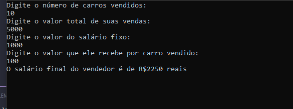

> Uma revendedora de carros usados paga a seus funcionários vendedores um salário fixo por mês, mais uma comissão também fixa para cada carro vendido e mais 5% do valor das vendas por ele efetuadas. Escrever um algoritmo/programa que leia o número de carros por ele vendidos, o valor total de suas vendas, o salário fixo e o valor que ele recebe por carro vendido. Calcule e escreva o salário final do vendedor.


### Identificar valores constantes
"... também fixa para cada carro vendido e mais 5% "
```
const double COMISSAO = 0.05;
```

#### Entradas

- leia o número de carros por ele vendidos
```
Console.WriteLine("Digite o número de carros vendidos: ");
int quantidadeCarrosVendidos = 0;
int.TryParse(Console.ReadLine(), out quantidadeCarrosVendidos);
```

- o valor total de suas vendas
```
Console.WriteLine("Digite o valor total de suas vendas: ");
double valorTotalVendas = 0;
double.TryParse(Console.ReadLine(), out valorTotalVendas);
```
- o salário fixo
```
Console.WriteLine("Digite o valor do salário fixo: ");
double salarioFixo = 0;
double.TryParse(Console.ReadLine(), out salarioFixo);
```
- o valor que ele recebe por carro vendido
```
Console.WriteLine("Digite o valor que ele recebe por carro vendido: ");
double valorPorCarroVendido = 0;
double.TryParse(Console.ReadLine(), out valorPorCarroVendido);
```

#### Saida

escreva o salário final do vendedor.
```
Console.WriteLine($"O salário final do vendedor é de R${salarioTotal} reais");
```

Calculo para gerar a saida
```
double totalRecebidoCarroVendido = valorPorCarroVendido * quantidadeCarrosVendidos;
double comissaoVendasEfetuadas = valorTotalVendas * COMISSAO;
double salarioFinalVendedor = salarioFixo + totalRecebidoCarroVendido + comissaoVendasEfetuadas;
```

##### Prove que você testou o que fez e que a modificação funcionou

<div align="center">
  
</div>

##### Como testar

- Extrair a pasta <strong>Binarios.zip</strong>
- Entre na pasta extraida e execute o arquivo <strong>Questao03.exe</strong>
- Digite os valores da sessão <strong>Prove que você testou o que fez e que a modificação funcionou</strong> para chegar no mesmo resultado


